# User stories — Kenney's Pickem modernization

Companion to [`modernization-plan.md`](./modernization-plan.md). These stories break that plan (plus CFBD schedule/score import and a Next.js Axios BFF) into implementable work. The legacy tree under `src/` is the functional spec for existing behavior; it is not modified until **US-26**.

## How to read this document

| Field | Meaning |
|---|---|
| **ID** | Stable handle (`US-01` … `US-40`). Use these in PRs and commit messages. |
| **Title** | Short name for boards and the index. |
| **User story** | `As a … I want … so that …` |
| **Description** | Behavior, target stack, and what legacy code or plan section it replaces. |
| **Acceptance criteria** | Testable conditions. A story is done only when all of them hold. |
| **Predecessors** | Stories that must be complete before this one starts. |
| **Successors** | Stories that wait on this one. |
| **Source** | Legacy types/JSPs and/or modernization-plan section. |
| **Status** | `Done` when every acceptance criterion holds and the work is on `main`. |

Password registration, JAAS, and SHA-256 hashing are intentionally absent: Google/Firebase owns identity.

### Assumptions

From the modernization plan’s open decisions:

- Any Google account may sign in and is auto-assigned the `player` claim.
- Default theme is Light.
- Picks **lock** when the week has begun; college football **ties are invalid**; CFBD import
  **creates weeks from `/calendar`** and runs as a **background job**; team/venue edits
  **refresh snapshots**; deletes **block** if referenced; themes are a **closed set of 18**;
  each Google sign-in **refreshes** email and name.

College Football Data (CFBD) is new product scope (not in the legacy app):

- Calls go only from the Spring Boot backend to `https://api.collegefootballdata.com` with `Authorization: Bearer ${CFBD_API_KEY}`. The key never ships to the browser. See [CFBD getting started](https://api.collegefootballdata.com/getting-started) and [authentication](https://api.collegefootballdata.com/authentication).
- Import uses `GET /games?year={season}&conference=SEC`, which includes every game with an SEC team on either side (non-conference opponents too), not only SEC-vs-SEC.
- Regular season is the default; postseason is an optional import flag.
- Scores are written only when CFBD marks the game `completed` with both `homePoints` and `awayPoints` (no live in-progress scoring).
- Game-day job timezone is `America/New_York`.
- Missing non-conference opponents and venues are auto-created. The 16 SEC teams must already exist and carry a `cfbdTeamId`.

---

## Index

| ID | Title | Epic | Status | Predecessors | Successors |
|---|---|---|---|---|---|
| US-01 | Bootstrap the Nx monorepo | A Foundation | Done | — | US-03, US-13 |
| US-02 | Publish architecture docs and Firestore rules | A Foundation | — | — | US-03, US-12, US-14, US-27, US-39 |
| US-03 | Stand up the Spring Boot API with Firestore persistence | B Backend platform | — | US-01, US-02 | US-04, US-05, US-06, US-27, US-40 |
| US-04 | Authenticate with Google via an HttpOnly session cookie | B Backend platform | — | US-03 | US-05, US-06, US-08, US-09, US-11, US-31, US-32 |
| US-05 | Manage seasons and season weeks via REST | C Manager APIs | — | US-03, US-04 | US-07, US-12, US-20, US-22, US-38 |
| US-06 | Manage venues, teams, and rivalries via REST | C Manager APIs | — | US-03, US-04 | US-07, US-12, US-20, US-22, US-27, US-35 |
| US-07 | Manage matchups via REST | C Manager APIs | — | US-05, US-06 | US-09, US-10, US-11, US-21, US-22, US-28, US-34, US-35 |
| US-08 | Manage users and themes via REST | C Manager APIs | — | US-04 | US-11, US-12, US-21, US-22, US-36 |
| US-09 | Load and save a player’s weekly confidence picks | D Game APIs | — | US-04, US-07 | US-16, US-22, US-24, US-34 |
| US-10 | Rank players on the season leaderboard | D Game APIs | — | US-07 | US-17, US-24 |
| US-11 | Show a team schedule and let a player edit their profile | D Game APIs | — | US-04, US-07, US-08 | US-18, US-19, US-24 |
| US-12 | Seed Firestore with reference data and themes | E Seed | — | US-02, US-05, US-06, US-08 | US-16, US-24, US-27 |
| US-13 | Scaffold the Next.js app and API client | F Frontend shell | — | US-01 | US-14, US-15, US-31 |
| US-14 | Apply switchable Light, Dark, and SEC school themes | F Frontend shell | — | US-02, US-13 | US-15, US-23, US-36 |
| US-15 | Sign in with Google and protect game and manager routes | F Frontend shell | — | US-04, US-13, US-14, US-31, US-32, US-33 | US-16, US-17, US-18, US-19, US-20, US-37 |
| US-31 | Proxy browser API calls through Next.js with Axios | F Frontend shell | — | US-04, US-13 | US-15, US-25, US-33 |
| US-32 | Verify the session cookie in Next.js middleware | F Frontend shell | — | US-04, US-13 | US-15 |
| US-33 | Lock down the BFF allowlist and internal jobs | F Frontend shell | — | US-31 | US-15, US-25, US-29, US-38 |
| US-16 | Make and reorder weekly confidence picks | G Player / manager UI | — | US-09, US-12, US-15, US-34 | US-22, US-24 |
| US-17 | View the season leaderboard | G Player / manager UI | — | US-10, US-15 | US-24 |
| US-18 | Browse a conference team’s schedule | G Player / manager UI | — | US-11, US-15 | US-24 |
| US-19 | Update nickname and pick a theme | G Player / manager UI | — | US-11, US-14, US-15, US-36 | US-23, US-24 |
| US-20 | Administer seasons, weeks, venues, teams, and rivalries | G Player / manager UI | — | US-05, US-06, US-15, US-35 | US-21, US-22 |
| US-21 | Administer matchups, users, and themes | G Player / manager UI | — | US-07, US-08, US-20, US-35, US-36 | US-22, US-24, US-30 |
| US-34 | Lock picks at week start and reject tied scores | D Game APIs | — | US-09 | US-16, US-22, US-24 |
| US-35 | Refresh snapshots and block unsafe deletes | C Manager APIs | — | US-06, US-07 | US-20, US-21, US-24 |
| US-36 | Keep the theme catalog a closed set of 18 | G Player / manager UI | — | US-08, US-14 | US-19, US-21 |
| US-37 | Empty season, sign-in failure, and expired session | G Player / manager UI | — | US-15 | US-24 |
| US-22 | Enforce validation parity on client and server | H Quality / deploy | — | US-05, US-07, US-08, US-16, US-21 | US-24 |
| US-23 | Meet WCAG AA contrast in every theme | H Quality / deploy | — | US-14, US-19 | US-24 |
| US-24 | Prove parity with emulator tests and Playwright | H Quality / deploy | — | US-12, US-16–US-19, US-21–US-23, US-29–US-40 | US-25 |
| US-25 | Deploy public Next.js and internal Spring Cloud Run | H Quality / deploy | — | US-24, US-29, US-31, US-33, US-39, US-40 | US-26 |
| US-39 | Provision Firestore composite indexes | A Foundation | — | US-02, US-03 | US-24, US-25 |
| US-40 | Expose Cloud Run health checks | H Quality / deploy | — | US-03, US-13 | US-25 |
| US-26 | Remove the legacy Struts application | H Quality / deploy | — | US-25 | — |
| US-27 | Integrate the College Football Data API client | I CFBD | — | US-02, US-03, US-06, US-12 | US-28 |
| US-28 | Import a season’s SEC-team matchups from CFBD | I CFBD | — | US-07, US-27, US-38 | US-29, US-30 |
| US-29 | Automatically import scores on game days | I CFBD | — | US-28, US-33 | US-24, US-25 |
| US-30 | Trigger and review CFBD imports from the admin UI | I CFBD | — | US-21, US-28, US-31, US-38 | US-24 |
| US-38 | Harden CFBD import (calendar weeks, opponents, job) | I CFBD | — | US-05, US-06, US-27, US-31, US-33 | US-28, US-30, US-24 |

---

## Dependency graph

```mermaid
flowchart TD
  US01[US-01 Nx monorepo]
  US02[US-02 Architecture docs]
  US03[US-03 Spring Boot + Firestore]
  US04[US-04 Session-cookie auth]
  US05[US-05 Seasons / weeks API]
  US06[US-06 Venues / teams / rivalries API]
  US07[US-07 Matchups API]
  US08[US-08 Users / themes API]
  US09[US-09 Picks API]
  US10[US-10 Leaderboard API]
  US11[US-11 Schedule + account API]
  US12[US-12 Seed script]
  US13[US-13 Next.js scaffold]
  US14[US-14 Theme system]
  US15[US-15 Frontend auth]
  US16[US-16 Picks screen]
  US17[US-17 Leaderboard screen]
  US18[US-18 Team schedule screen]
  US19[US-19 Account screen]
  US20[US-20 Manager UI: reference data]
  US21[US-21 Manager UI: matchups / users / themes]
  US22[US-22 Validation parity]
  US23[US-23 Theme a11y]
  US24[US-24 Automated tests]
  US25[US-25 Public Next.js / internal Spring]
  US26[US-26 Remove legacy src]
  US27[US-27 CFBD client]
  US28[US-28 Import matchups]
  US29[US-29 Game-day scores]
  US30[US-30 Import admin UI]
  US31[US-31 Next.js Axios BFF]
  US32[US-32 Next.js session verify]
  US33[US-33 BFF allowlist]
  US34[US-34 Pick lock / no ties]
  US35[US-35 Snapshots / block delete]
  US36[US-36 Closed 18 themes]
  US37[US-37 Empty and error UX]
  US38[US-38 CFBD import job]
  US39[US-39 Firestore indexes]
  US40[US-40 Health checks]

  US01 --> US03
  US01 --> US13
  US02 --> US03
  US02 --> US12
  US02 --> US14
  US03 --> US04
  US03 --> US05
  US03 --> US06
  US04 --> US05
  US04 --> US06
  US04 --> US08
  US04 --> US09
  US04 --> US11
  US05 --> US07
  US05 --> US12
  US06 --> US07
  US06 --> US12
  US07 --> US09
  US07 --> US10
  US07 --> US11
  US08 --> US11
  US08 --> US12
  US09 --> US16
  US10 --> US17
  US11 --> US18
  US11 --> US19
  US12 --> US16
  US12 --> US24
  US13 --> US14
  US13 --> US15
  US13 --> US31
  US04 --> US31
  US31 --> US15
  US31 --> US25
  US31 --> US33
  US04 --> US32
  US13 --> US32
  US32 --> US15
  US33 --> US15
  US33 --> US25
  US33 --> US29
  US33 --> US38
  US09 --> US34
  US34 --> US16
  US06 --> US35
  US07 --> US35
  US35 --> US20
  US35 --> US21
  US08 --> US36
  US14 --> US36
  US36 --> US19
  US36 --> US21
  US15 --> US37
  US05 --> US38
  US27 --> US38
  US38 --> US28
  US38 --> US30
  US02 --> US39
  US03 --> US39
  US39 --> US25
  US03 --> US40
  US13 --> US40
  US40 --> US25
  US14 --> US15
  US14 --> US23
  US15 --> US16
  US15 --> US17
  US15 --> US18
  US15 --> US19
  US15 --> US20
  US05 --> US20
  US06 --> US20
  US20 --> US21
  US07 --> US21
  US08 --> US21
  US05 --> US22
  US07 --> US22
  US08 --> US22
  US16 --> US22
  US21 --> US22
  US16 --> US24
  US17 --> US24
  US18 --> US24
  US19 --> US24
  US21 --> US24
  US22 --> US24
  US23 --> US24
  US24 --> US25
  US25 --> US26
  US02 --> US27
  US03 --> US27
  US06 --> US27
  US07 --> US28
  US12 --> US27
  US27 --> US28
  US28 --> US29
  US28 --> US30
  US21 --> US30
  US29 --> US24
  US29 --> US25
  US30 --> US24
```

---

## Suggested implementation order

Matches the modernization plan’s build order, with CFBD inserted after seed data.

| Step | Plan phase | Stories |
|---|---|---|
| 1 | Nx + docs + Firestore rules | US-01, US-02 |
| 2 | Firestore, BaseRepository, DTOs, session filter | US-03, US-04 |
| 3 | Reference-data services + manager CRUD APIs | US-05, US-06, US-07, US-08 |
| 4 | Matchup / pick / leaderboard + game endpoints | US-09, US-10, US-11 |
| 5 | Seed script | US-12 |
| 5b | CFBD client, hardened import job, game-day scores | US-27, US-38, US-28, US-29 |
| 6 | Frontend scaffold, Axios BFF, allowlist, session verify, themes, Google auth | US-13, US-31, US-33, US-32, US-14, US-15 |
| 7 | Game screens then manager CRUD (including import UI) | US-16–US-21, US-34–US-37, US-30 |
| 8 | Validation + WCAG AA | US-22, US-23 |
| 9 | Indexes, health, tests, public Next.js + internal Spring, Scheduler, delete `src/` | US-39, US-40, US-24, US-25, US-26 |

US-01 and US-13 can start in parallel after the repo is the Nx workspace. Frontend game screens (US-16–US-19) can proceed as soon as their APIs and US-15 land; they do not wait on CFBD.

---

## Epic A — Foundation

### US-01 — Bootstrap the Nx monorepo

**Status:** Done ([PR #1](https://github.com/bassetthnd824/pickem/pull/1)).

**User story.** As a developer, I want a single Nx workspace that hosts the Next.js frontend and the Maven Spring Boot backend so that both stacks share one project graph, task runner, and CI cache.

**Description.** Replace the single Java 7 Maven WAR as the *build* unit (the legacy tree stays on disk as reference). Bootstrap with `@jnxplus/nx-maven:init` (Java 21, Spring Boot parent POM), generate `apps/backend`, add `apps/frontend` with `@nx/next`, and set `skipProjectWithoutProjectJson: true` so the existing `pom.xml` under `src/` is not pulled into the Nx graph.

**Acceptance criteria.**

- [x] Workspace root contains `nx.json`, `package.json`, and `tsconfig.base.json`.
- [x] `apps/frontend` is a TypeScript Next.js App Router app generated by `@nx/next`.
- [x] `apps/backend` is a Maven Spring Boot 3.x / Java 21 module wired through `@jnxplus/nx-maven`.
- [x] `nx build|test|serve frontend` and `nx build|test|serve backend` succeed (backend tasks delegate to Maven).
- [x] The legacy `src/` Maven project is excluded from the Nx graph.
- [x] Nothing under `src/main` is modified.

**Predecessors:** none.

**Successors:** US-03, US-13.

**Source.** Modernization plan: *Target repository layout*; legacy `pom.xml`.

---

### US-02 — Publish architecture docs and Firestore rules

**User story.** As a developer, I want the Firestore data model, REST contract, SEC theme colors, and security rules written down so that backend, frontend, and seed work share one source of truth.

**Description.** Expand the modernization plan’s collections table, REST surface, and SEC color table into dedicated docs. Include a parity checklist derived from the legacy screen inventory (`tiles.xml` + `struts.xml`).

**Acceptance criteria.**

- [x] [`docs/firestore-data-model.md`](./firestore-data-model.md) lists collections (`seasons`, `seasonWeeks`, `venues`, `teams`, `rivalries`, `matchups`, `picks`, `users`, `themes`), denormalized snapshots, audit/`version` fields, `cfbdTeamId` / `cfbdVenueId` / `cfbdGameId`, and the drop of `PCKM_GROUP` / passwords / sequences.
- [x] [`docs/api-contract.md`](./api-contract.md) lists every `/api/auth`, `/api/game`, and `/api/manager` endpoint (including CFBD import and score-sync) with auth role and ISO-8601 dates, and states that the **browser calls Next.js `/api` only**; Next.js Axios-forwards to Spring. Spring has no public URL.
- [x] [`docs/sec-theme-colors.md`](./sec-theme-colors.md) contains the 18 theme keys and hex values from the plan.
- [x] A Firestore rules skeleton ([`firestore.rules`](../firestore.rules)) denies client writes; only the backend service account writes.
- [x] A parity checklist ([`docs/parity-checklist.md`](./parity-checklist.md)) maps each legacy JSP/action to a new route/endpoint, plus the CFBD import UI.
- [x] Open decisions are recorded ([`docs/open-decisions.md`](./open-decisions.md)): open Google sign-in with auto-`player`; default theme Light; CFBD `conference=SEC` includes non-conference games; scores only when `completed`.

**Predecessors:** none.

**Successors:** US-03, US-12, US-14, US-27, US-39.

**Source.** Modernization plan: *Data model*, *REST surface*, *UI Color Themes*, *Open decisions*.

---

## Epic B — Backend platform and auth

### US-03 — Stand up the Spring Boot API with Firestore persistence

**User story.** As a developer, I want a Spring Boot REST API that talks to Firestore with a shared repository and DTOs so that domain services can persist denormalized documents instead of JPA entities.

**Description.** Ports `GenericHibernateBean` + `AbstractBaseEntity` into `BaseRepository<T>` (`findById` / `findAll` / `query` / `save` / `delete`, audit stamps, `version` checked in a transaction). Layering: `config/`, `repository/`, `service/`, `web/`. Use `spring-cloud-gcp-starter-firestore` or the Firestore SDK, `spring-boot-starter-web/security/validation`, Springdoc. Dates are `java.time` ISO-8601 (replaces `DateConverter` / `DateSerializerDeserializer`).

**Acceptance criteria.**

- [x] Backend boots against the Firestore emulator.
- [x] DTOs exist for all nine collections, including denormalized team/venue snapshots on matchups, teams, and rivalries.
- [x] `BaseRepository` stamps `createDate` / `createUser` / `lastUpdateDate` / `lastUpdateUser` and rejects a stale `version` in a transaction.
- [x] Spring is not browser-facing: no CORS configuration is required (the Next.js BFF is the only caller). Local and production browsers talk only to Next.js.
- [x] Springdoc serves an OpenAPI spec.
- [x] No Derby, JPA, EJB, or Struts dependencies in `apps/backend`.

**Predecessors:** US-01, US-02.

**Successors:** US-04, US-05, US-06, US-27, US-40.

**Source.** Modernization plan: *Backend — Spring Boot API*; legacy `GenericHibernateBean`, `AbstractBaseEntity`.

---

### US-04 — Authenticate with Google via an HttpOnly session cookie

**User story.** As a player, I want to sign in with Google and stay signed in via a server session cookie so that I never manage a password and API calls are authenticated automatically.

**Description.** Replaces JAAS FORM (`web.xml` login-config, `j_security_check`, `LoginFilter`, `RegisterAction`, unsalted SHA-256). The client POSTs a Firebase ID token once to **Next.js** `POST /api/auth/session`; the BFF Axios-forwards it to Spring. Spring verifies it, provisions `users` (email/name from Google, `player` claim if new), and mints `createSessionCookie` (~5–14 days). Next.js copies `Set-Cookie` to the browser as `__session` HttpOnly; Secure; SameSite=Lax (or Strict), **host-only** on the Next.js hostname (do not set `Domain=`). `SessionCookieFilter` verifies the forwarded cookie with `checkRevoked=true` and loads custom claims. Spring CSRF against the browser is N/A. `POST /api/auth/logout` (via the BFF) clears the cookie. `GET /api/auth/me` returns profile + roles.

**Acceptance criteria.**

- First Google sign-in creates a `users` doc keyed by Firebase `uid` with email, first/last name, default `themeId=light`, `roles: ['player']`, and sets the `player` custom claim.
- Repeat sign-in does not duplicate the user doc; it **refreshes** `emailAddr`, `firstName`, and `lastName` from the Google profile and leaves `nickName` and `themeId` unchanged.
- Subsequent browser calls go to Next.js `/api` with the host-only cookie; Spring authenticates the cookie only after Axios forwards it (the browser never calls Spring).
- Unauthenticated requests to `/api/game/**` and `/api/manager/**` are rejected.
- Players are blocked from `/api/manager/**`; managers may call both namespaces.
- Logout clears the cookie; a revoked session is rejected on the next request.
- No password fields, hashes, or registration endpoint exist.

**Predecessors:** US-03.

**Successors:** US-05, US-06, US-08, US-09, US-11, US-31, US-32.

**Source.** Modernization plan: *Auth flow*; legacy `web.xml`, `LoginFilter`, `RegisterAction`, `LogoutAction`, `login.jsp`, `registration.jsp`.

---

## Epic C — Manager APIs

### US-05 — Manage seasons and season weeks via REST

**User story.** As a manager, I want to CRUD seasons and weeks so that the schedule calendar exists before matchups and picks.

**Description.** Ports `SeasonAction` / `SeasonBean` and `SeasonWeekAction` / `SeasonWeekBean`. Current season uses `isCurrent` and/or a date window (replaces the Derby `getCurrentSeason` native query). Helpers: GET season by id, GET weeks by season. Week begin date must be Thursday; end date Wednesday = begin + 6 days; week 1 begin equals season begin; later weeks begin = season begin + `(weekNumber - 1) * 7`.

**Acceptance criteria.**

- `GET/POST/PUT/DELETE /api/manager/seasons` and `/api/manager/season-weeks` require `MANAGER`.
- Season `season` is unique; begin year matches the season year; end year is the season year or season year + 1.
- Weeks are queryable by `seasonId`; helper endpoints replace `seasons_getSeasonById` and `seasonWeeks_getSeasonWeeksBySeason` / `getSeasonWeekById`.
- Invalid week bounds return 400 with the legacy message intent (“season week begin/end date is invalid”, “Week Begin Date is invalid”).
- List/search by example fields (season name, dates, week number) works.
- Audit and version fields are set on write.
- Manual week CRUD still requires Thursday begin and Wednesday = begin + 6. Imported CFBD weeks (US-38) are not subject to that day-of-week rule.

**Predecessors:** US-03, US-04.

**Successors:** US-07, US-12, US-20, US-22, US-38.

**Source.** Modernization plan: manager REST; legacy `SeasonAction`, `SeasonWeekAction`, `ValidSeasonBeginDate` / `EndDate`, `ValidSeasonWeekBeginDate` / `EndDate`.

---

### US-06 — Manage venues, teams, and rivalries via REST

**User story.** As a manager, I want to CRUD venues, teams, and rivalries so that matchups have teams, home stadiums, and named rivalries.

**Description.** Ports `VenueAction`, `TeamAction` (`getTeamById` for venue auto-fill), and `RivalryAction`. Teams embed `homeVenue{id,name,cityState}` and keep `homeVenueId`. Rivalries embed both team snapshots. Home ≠ away / team1 ≠ team2.

**Acceptance criteria.**

- Standard REST CRUD under `/api/manager/venues|teams|rivalries` requires `MANAGER`.
- Team requires name (≤40, unique), squad (≤40), `conferenceMember` flag, and a home venue.
- `GET /api/manager/teams/{id}` returns the team including home venue (replaces `teams_getTeamById`).
- A conference-member query exists (replaces `TeamBean.getConferenceTeams` / `getNumberOfConferenceTeams`).
- Rivalry requires two different teams and a name (≤60).
- Venue requires name and cityState (≤60).
- Team and venue documents accept optional `cfbdTeamId` / `cfbdVenueId` (unique when present) so CFBD import can match without relying on display names.

**Predecessors:** US-03, US-04.

**Successors:** US-07, US-12, US-20, US-22, US-27, US-35.

**Source.** Modernization plan: manager REST + denormalization; legacy `VenueAction`, `TeamAction`, `RivalryAction`, `AssertRivalryTeamsNotEqual`.

---

### US-07 — Manage matchups via REST

**User story.** As a manager, I want to CRUD weekly matchups including scores so that players have games to pick and the leaderboard can score them.

**Description.** Ports `MatchupAction`. Documents denormalize season/week, home/away team+squad, venue, and optional rivalry name. `winningTeamId` is computed server-side from scores (home wins if `homeScore > awayScore`; else away — same as `MatchupUserPick.getWinningTeamId()`; unplayed → no winner / `-1` equivalent). Matchup date must fall in the week’s `[beginDate, endDate]`. Home team ≠ away team.

**Acceptance criteria.**

- CRUD under `/api/manager/matchups` requires `MANAGER`.
- Creating/updating a matchup rejects equal home and away teams and dates outside the week.
- Selecting a home team can be used by the client to default venue from the team’s home venue (API returns enough data; auto-fill is a GET of the team).
- Scores may be null (unplayed) or both set; `winningTeamId` is derived, not a free-form client field.
- List/search by season, week, date, team, venue works.
- Matchup documents accept optional unique `cfbdGameId` for idempotent CFBD upserts.

**Predecessors:** US-05, US-06.

**Successors:** US-09, US-10, US-11, US-21, US-22, US-28, US-34, US-35.

**Source.** Modernization plan: matchups collection + manager REST; legacy `MatchupAction`, `AssertMatchupTeamsNotEqual`, `MatchupDateValidator`.

---

### US-08 — Manage users and themes via REST

**User story.** As a manager, I want to list/edit users and CRUD themes and to grant the manager role so that I can elevate admins and control the selectable theme list.

**Description.** Ports `UserAction` and `ThemeAction`. Groups become `roles[]` plus Firebase custom claims (`player` / `manager`). A user must have at least one role. Theme `themePath` (now a theme key) must not begin with `/`. Managers do not set passwords. Elevating a user to manager uses Admin SDK `setCustomUserClaims`; the next session refresh picks up the claim.

**Acceptance criteria.**

- `/api/manager/users` and `/api/manager/themes` require `MANAGER`.
- User list/search by email, first name, last name.
- Updating roles to include `manager` sets the Firebase custom claim; removing it clears the claim.
- Saving a user with zero roles returns 400 (“User must belong to at least one group” / at least one role).
- Theme name unique ≤40; `themePath` / key ≤100 and does not start with `/`; `active` flag is persisted.
- No password create/reset endpoints.

**Predecessors:** US-04.

**Successors:** US-11, US-12, US-21, US-22, US-36.

**Source.** Modernization plan: users/themes + custom claims; legacy `UserAction`, `ThemeAction`, `AssertThemePathDoesNotBeginWithSlash`, `AssertUserHasAtLeastOneGroup`.

---

## Epic D — Game APIs

### US-09 — Load and save a player’s weekly confidence picks

**User story.** As a player, I want the current season’s matchups joined with my picks and to save a week’s ranks in one request so that I can play the confidence pool.

**Description.** Ports `MainAction` + `MatchupBean.getMatchupUserPicksByUserSeason` + `UserPickBean.persistList`. Join matchups and picks in code (no SQL). `GET /api/game/main` returns current-season weeks, the user’s matchup/pick grid, and `numberOfConferenceTeams`. `POST /api/game/picks` bulk-upserts; rows with no `pickedTeamId` are dropped. Rank is 1..N where N = conference team count. Preserve `isCurrentOrPastWeek()`: scores/results are hidden or picks locked until the week is current or past.

**Acceptance criteria.**

- Authenticated `GET /api/game/main` returns weeks of matchups with denormalized teams, venue, rivalry, scores, existing pick/rank, and conference-team count.
- `POST /api/game/picks` upserts one pick doc per user+matchup with `rank` and `pickedTeamId` in a batched write.
- Empty picks (no team selected) are not persisted.
- Picks belong to the authenticated user; a player cannot write another user’s picks.
- Scoring icons / points follow `getScore()`: rank points only when both scores exist and `pickedTeamId == winningTeamId`.
- Future weeks (before `weekBeginDate`) do not expose results as scored; current/past weeks do.

**Predecessors:** US-04, US-07.

**Successors:** US-16, US-22, US-24, US-34.

**Source.** Modernization plan: `MatchupService` / `PickService`; legacy `MainAction`, `UserPickBean.persistList`, `MatchupUserPick`.

---

### US-10 — Rank players on the season leaderboard

**User story.** As a player, I want a season leaderboard of total confidence points so that I can see who is winning.

**Description.** Ports `LeaderBoardAction` / `MatchupBean.getLeaderBoardForSeason` / `UserScore.compareTo`. Load season matchups (derive winner) and all picks; sum `rank` where the pick matches the winner; sort score descending, tie-break by userId (legacy `User.compareTo` on userId). Display nickname. Preserve week-lock scoring rules.

**Acceptance criteria.**

- `GET /api/game/leaderboard?seasonId=` (default current season) requires authentication.
- A correct pick adds its rank; incorrect or unscored matchups add 0.
- Results sort by score descending; ties break by userId ascending.
- Response includes rank, nickname, and score (replaces `leaderBoard.jsp` columns).
- Players who have no picks still appear with score 0 if they exist as users (legacy iterates `userBean.findAll()`).

**Predecessors:** US-07.

**Successors:** US-17, US-24.

**Source.** Modernization plan: `LeaderboardService`; legacy `LeaderBoardAction`, `UserScore`.

---

### US-11 — Show a team schedule and let a player edit their profile

**User story.** As a player, I want a conference team’s W/L schedule and to update my nickname and theme so that I can follow teams and personalize my account without touching credentials.

**Description.** Ports `TeamScheduleAction` / `getMatchupsBySeasonTeam` (opponent `"at HomeTeam"` when away; score string; W/L from the selected team’s perspective) and `AccountAction` minus passwords. `GET/PUT /api/game/account` allows `nickName` and `themeId` only; email/name come from Google and are read-only for the player.

**Acceptance criteria.**

- `GET /api/game/team-schedule?teamId=&seasonId=` returns date, opponent label, score result, and W/L for conference teams in the current season.
- Away games prefix opponent with `"at "`.
- Unplayed games omit W/L and score result.
- `GET /api/game/account` returns email, name, nickName, themeId.
- `PUT /api/game/account` updates nickName (required, ≤40) and themeId; rejects password fields; does not change email/name.
- Both endpoints require a signed-in player.

**Predecessors:** US-04, US-07, US-08.

**Successors:** US-18, US-19, US-24.

**Source.** Modernization plan: team-schedule + account endpoints; legacy `TeamScheduleAction`, `AccountAction`, `account.jsp` (password fields dropped).

---

## Epic E — Seed data

### US-12 — Seed Firestore with reference data and themes

**User story.** As a developer, I want a seed script that loads SEC teams, venues, rivalries, a sample season/weeks/matchups, 18 themes, and one bootstrap manager so that local emulator and first production bootstrap have playable data.

**Description.** Translate `src/main/resources/import.sql.old` plus `docs/sec-theme-colors.md`. No historical picks. Users are not seeded with passwords; grant `manager` (and `player`) by email to a known Google account.

**Acceptance criteria.**

- `tools/seed` runs against the Firestore emulator and can run once against a real project.
- Seeds venues, teams (conference members + home venues), rivalries, seasons, season weeks, sample matchups, and 18 theme docs (light, dark, 16 SEC keys).
- Each of the 16 SEC teams is seeded with the CFBD school `cfbdTeamId` (and a name that matches CFBD `homeTeam` / `awayTeam` strings) so schedule import can resolve conference teams.
- Home venues for those teams carry `cfbdVenueId` when known.
- Bootstrap manager email receives Firebase custom claims `manager` + `player`.
- No pick documents and no password hashes are written.
- Script is idempotent enough to re-run in the emulator without manual cleanup, or documents a reset step.

**Predecessors:** US-02, US-05, US-06, US-08.

**Successors:** US-16, US-24, US-27.

**Source.** Modernization plan: *Seed script*; legacy `import.sql.old`.

---

## Epic F — Frontend shell

### US-13 — Scaffold the Next.js app and API client

**User story.** As a player, I want a Next.js App Router UI with a typed API client so that screens can fetch JSON instead of rendering JSPs.

**Description.** Replaces Tiles `template.jsp`, jQuery, Underscore, and Bootstrap 3. Stack: Next.js App Router, TypeScript, Tailwind, TanStack Query, TanStack Form, Valibot (schemas filled in US-22), `credentials: 'include'`. Optional `libs/shared-schemas` is owned here if created. Browser API calls are same-origin `/api` on Next.js; US-31 adds the Axios BFF that forwards them to Spring.

**Acceptance criteria.**

- `apps/frontend` has root layout, Tailwind, and a TanStack Query provider.
- Browser API client uses relative `/api` paths with `credentials: 'include'` and never takes a Spring/Cloud Run API origin as a public base URL.
- Dates use native `<input type="date">` (no Bootstrap datetimepicker / moment).
- `nx serve frontend` runs locally.

**Predecessors:** US-01.

**Successors:** US-14, US-15, US-31.

**Source.** Modernization plan: *Frontend — Next.js App Router*; legacy `template.jsp`.

---

### US-14 — Apply switchable Light, Dark, and SEC school themes

**User story.** As a player, I want the UI to follow semantic color tokens and 18 named themes so that choosing a school theme restyles the whole app without hard-coded hex in components.

**Description.** CSS variables (`--color-bg` / `surface` / `text` / `muted` / `border` / `primary` / `primary-fg` / `secondary` / `accent` / `success` / `danger`) mapped in Tailwind. `[data-theme="alabama"]` etc. on `<html>`. Default Light. Dark primaries use light surfaces with team color on nav/headers/buttons per the plan’s notes.

**Acceptance criteria.**

- All 18 theme keys exist as `data-theme` blocks using the documented hex values.
- Components use semantic utilities only (`bg-surface`, `text-primary`, etc.).
- Root layout can set `data-theme` from the user’s `themeId` without a flash of the wrong theme when the cookie/profile is known at SSR.
- First visit with no user theme uses Light.
- Correct/incorrect pick icons use success/danger tokens.

**Predecessors:** US-02, US-13.

**Successors:** US-15, US-23, US-36.

**Source.** Modernization plan: *UI Color Themes*; legacy `Theme` entity (now a live feature).

---

### US-15 — Sign in with Google and protect game and manager routes

**User story.** As a player, I want a “Sign in with Google” page and a shared navbar so that I can reach game screens and managers can reach Admin.

**Description.** Replaces `login.jsp`, `loginError.jsp`, `accessRestricted.jsp`, `registration.jsp`, `LogoutAction`, and `navbar.jsp`. Middleware reads the session cookie: `(game)` any signed-in user, `(manager)` requires the `manager` claim. Client `AuthProvider` hydrates from `GET /api/auth/me`. No register route.

**Acceptance criteria.**

- `/login` shows a single Google button; unauthenticated visits to game/manager routes redirect here.
- Successful Google popup/redirect POSTs the ID token to `/api/auth/session` then lands on `/main`.
- Navbar: Home, Leader Board, Team Schedule, My Account, Logout; Admin dropdown only if `isManager`.
- Admin dropdown links: Users, Themes, Teams, Venues, Rivalries, Seasons, Season Weeks, Matchups.
- Logout calls `POST /api/auth/logout` and returns to login.
- Players who hit a manager URL see a forbidden/restricted state (not the admin screens).

**Predecessors:** US-04, US-13, US-14, US-31, US-32, US-33.

**Successors:** US-16, US-17, US-18, US-19, US-20, US-37.

**Source.** Modernization plan: *Routing / layout* + *Auth guard*; legacy `navbar.jsp`, `login.jsp`, `web.xml` security-constraints.

---

### US-31 — Proxy browser API calls through Next.js with Axios

**User story.** As a player, I want the browser to call only the Next.js app so that the Spring API is never exposed to the public internet.

**Description.** App Router catch-all (or per-namespace) Route Handlers under `app/api/` are a BFF. Each handler uses **Axios** (server-only) to forward method, query string, body, and the incoming `__session` cookie to Spring at `SPRING_API_BASE_URL`. Responses (status, JSON, `Set-Cookie`) are copied back; cookies are rewritten host-only for the Next.js origin. In GCP, Axios also sends a Cloud Run IAM identity token so Spring can require `roles/run.invoker`. Axios must not ship in the client bundle.

**Acceptance criteria.**

- Browser network traces for game and manager flows show requests only to the Next.js origin (`/api/...`); none go to a Spring or `*.run.app` host.
- Axios runs only in Route Handlers / server code, with `SPRING_API_BASE_URL` from the server environment (local default `http://localhost:8080`).
- Forwarded requests include the browser’s `__session` cookie when present; session login copies Spring `Set-Cookie` onto the Next.js response without a `Domain=` attribute and with `Path=/`.
- GET/POST/PUT/DELETE, query params, and JSON bodies round-trip with the same status codes Spring returns.
- Local `nx serve` still proxies through Next.js (the browser does not call Spring on another port).
- A missing Spring base URL fails clearly on the server; the client never receives the Spring URL.

**Predecessors:** US-04, US-13.

**Successors:** US-15, US-25, US-33.

**Source.** Modernization plan: *Frontend BFF proxy*; Axios server-side.

---

## Epic G — Player and manager UI

### US-16 — Make and reorder weekly confidence picks

**User story.** As a player, I want the weekly picks grid with up/down rank reorder so that I can assign confidence points and save my card.

**Description.** Ports `main.jsp` + `main.js`. Welcome line uses first name + current season. Per week: date, rivalry, away/home radio, scores, rank, venue, check/cross. Default rank walks down from `numberOfConferenceTeams`. Up/down buttons swap rows and renumber ranks.

**Acceptance criteria.**

- Home shows “Welcome {firstName}, Season {season}”.
- Each week lists matchups; radio selects home or away; rank displays and is submitted.
- Up/down reorder within a week and renumber ranks from N down to 1.
- Save persists picks; Cancel reloads without saving.
- Check icon when pick matches winner; cross when it does not; neither when unscored.
- Unauthenticated users never see this page.

**Predecessors:** US-09, US-12, US-15, US-34.

**Successors:** US-22, US-24.

**Source.** Legacy `main.jsp`, `main.js`, `MainAction`.

---

### US-17 — View the season leaderboard

**User story.** As a player, I want a ranked table of nicknames and scores so that I can see standings.

**Description.** Ports `leaderBoard.jsp`. Columns: Rank, User (nickname), Score. Data from US-10.

**Acceptance criteria.**

- Leaderboard page shows Rank, User (nickname), Score.
- Order and scores match US-10.
- Reachable from the navbar for any signed-in user.

**Predecessors:** US-10, US-15.

**Successors:** US-24.

**Source.** Legacy `leaderBoard.jsp`, `LeaderBoardAction`.

---

### US-18 — Browse a conference team’s schedule

**User story.** As a player, I want to pick a conference team and see its season schedule so that I can review opponents and results.

**Description.** Ports `teamSchedule.jsp` + `teamSchedule.js` AJAX. Conference-team dropdown; fetch schedule via TanStack Query (no full page reload).

**Acceptance criteria.**

- Dropdown lists conference teams as `{teamName} {squadName}`.
- Selecting a team loads date, opponent, score, W/L without a full navigation.
- Away opponent labels use the `"at "` prefix.
- Empty selection shows no rows.

**Predecessors:** US-11, US-15.

**Successors:** US-24.

**Source.** Legacy `teamSchedule.jsp`, `TeamScheduleAction.getSchedule`.

---

### US-19 — Update nickname and pick a theme

**User story.** As a player, I want an account page to set my screen name and theme so that the app shows my nickname and colors.

**Description.** Replaces `account.jsp` password form with nickName + theme picker. Applying a theme sets `data-theme` immediately and persists `themeId` on the user doc.

**Acceptance criteria.**

- Account shows read-only email and name from Google, editable nickName, and a theme picker listing active themes.
- Saving theme restyles the app (navbar/headers/buttons) without a full reload beyond the token update.
- No old/new/confirm password fields.
- Cancel discards unsaved changes.

**Predecessors:** US-11, US-14, US-15, US-36.

**Successors:** US-23, US-24.

**Source.** Modernization plan: account + theme picker; legacy `account.jsp` (password flow removed).

---

### US-20 — Administer seasons, weeks, venues, teams, and rivalries

**User story.** As a manager, I want list/search/detail screens for seasons, weeks, venues, teams, and rivalries so that I can maintain reference data from the browser.

**Description.** Replaces `searchTemplate.jsp` accordion CRUD + `adminscreen.js` for those five resources. Reusable list/detail pattern. Season → weeks cascading select. Native date inputs.

**Acceptance criteria.**

- Each resource has list (search + results) and detail (add/edit) routes under `(manager)/`.
- Search, add, edit, delete, cancel behave like `BaseAction` (return to last search).
- Season week form cascading: choose season, then week dates default from season begin + `(weekNumber - 1) * 7`, end = begin + 6.
- Only users with the manager claim can open these routes.
- Validation errors from the API render on the form.

**Predecessors:** US-05, US-06, US-15, US-35.

**Successors:** US-21, US-22.

**Source.** Legacy `searchTemplate.jsp`, `adminscreen.js`, `BaseAction`, season/week/venue/team/rivalry JSPs.

---

### US-21 — Administer matchups, users, and themes

**User story.** As a manager, I want list/detail screens for matchups, users, and themes including cascading season→week and home-team venue auto-fill so that I can enter the weekly slate, promote managers, and maintain the theme catalog.

**Description.** Completes the manager UI. Cascading selects use TanStack Query against the helper GET endpoints (replaces `adminscreen.js` double-select and `teams_getTeamById` venue auto-fill).

**Acceptance criteria.**

- Matchup form: season select loads weeks; choosing a week constrains matchup date to that week; choosing home team sets venue to the team’s home venue (still editable).
- Matchup form captures home/away, scores, venue, date.
- Users form edits name/email/nickname/theme and role checkboxes (`player` / `manager`); at least one role required.
- Promoting a user to manager is visible on their next session.
- Themes form edits name, key/path (no leading slash), active.
- Cascading selects use TanStack Query against the helper GET endpoints.

**Predecessors:** US-07, US-08, US-20, US-35, US-36.

**Successors:** US-22, US-24, US-30.

**Source.** Legacy `matchup.jsp`, `user.jsp`, `theme.jsp`, `adminscreen.js`.

---

## Epic I — CFBD schedule and scores

### US-27 — Integrate the College Football Data API client

**User story.** As a developer, I want a server-side CFBD client with stored external IDs so that schedule and score imports can call College Football Data without putting the API key in the browser.

**Description.** New work (no legacy equivalent). HTTP client in `apps/backend` against `https://api.collegefootballdata.com` using `Authorization: Bearer ${CFBD_API_KEY}`. Wrap `GET /games`, `GET /calendar`, and `GET /scoreboard`. Map CFBD `homeId` / `awayId` / `venueId` onto our `cfbdTeamId` / `cfbdVenueId`. Do not use the Patreon-only weather endpoint. Official Java SDK is not required; Spring `RestClient` / `WebClient` is enough.

**Acceptance criteria.**

- `CFBD_API_KEY` is read from the environment (or Secret Manager in deploy); a missing key fails fast at startup or on first call with a clear error.
- Client sends `Authorization: Bearer …` and never logs the key.
- `GET /games?year=&conference=SEC` (optional `week`, `seasonType`) returns typed game records (`id`, `season`, `week`, `startDate`, `completed`, `venue` / `venueId`, home/away names/ids/points).
- `GET /calendar?year=` returns CFBD weeks (`week`, `seasonType`, `startDate`, `endDate`).
- `GET /scoreboard?classification=fbs&conference=SEC` is callable for current-day status.
- A 401 / 429 / 5xx from CFBD is surfaced as a controlled backend error, not a stack dump to the client.
- No frontend bundle contains the CFBD key or calls `api.collegefootballdata.com`.

**Predecessors:** US-02, US-03, US-06, US-12.

**Successors:** US-28.

**Source.** [CFBD getting started](https://api.collegefootballdata.com/getting-started), [Games API](https://api.collegefootballdata.com/api/games).

---

### US-28 — Import a season’s SEC-team matchups from CFBD

**User story.** As a manager, I want to import all games involving the 16 SEC teams for a season so that I do not have to key the weekly slate by hand.

**Description.** Mapping rules for the CFBD import **job** (US-38), not a long-lived synchronous BFF POST. The job calls `GET /games?year={season.season}&conference=SEC` (optional `seasonType`, default `regular`). Dedupes by CFBD `id`. For each game: resolve home/away via `cfbdTeamId` (US-38 creates a valid non-conference team if missing); resolve venue (US-38); map `startDate` into a `seasonWeek` created from CFBD `/calendar` (US-38); upsert a matchup keyed by `cfbdGameId`. Do not overwrite manager-entered scores unless the CFBD game is `completed`. Neutral-site games use the CFBD venue. Rivalry name is filled when the two teams already have a rivalry.

**Acceptance criteria.**

- Import is started as a job (US-38) by a manager; season must exist; its `season` year is the CFBD `year`.
- One CFBD game produces at most one matchup; re-running the import updates schedule fields (date, venue, teams) in place and does not duplicate rows.
- All 16 conference members’ games for that year are present after a successful import (union of games where home or away is a conference member).
- Unknown FCS/FBS opponents are created with `conferenceMember=false` and the CFBD team name/id; unknown venues are created from the CFBD venue name (city/state best-effort).
- Games that cannot be mapped (no matching week, missing conference team id) are listed in the import report as skipped with a reason; mapped games are counted created vs updated.
- Import does not write picks and does not set scores for uncompleted games.
- SEC-vs-SEC games appear once.

**Predecessors:** US-07, US-27, US-38.

**Successors:** US-29, US-30.

**Source.** New feature; CFBD `GET /games`.

---

### US-29 — Automatically import scores on game days

**User story.** As a manager, I want final scores pulled from CFBD on days that have games so that the picks grid and leaderboard update without manual score entry.

**Description.** A backend job (Cloud Scheduler in production; also callable as an internal/admin endpoint) loads the current season’s matchups whose `matchupDate` is today in `America/New_York` (or whose CFBD game is still not completed from a kickoff that spilled past midnight). For those with a `cfbdGameId`, it fetches CFBD `GET /games` and, when `completed` is true and both point totals are present, writes `homeTeamScore` / `awayTeamScore` and recomputes `winningTeamId`. Uncompleted games stay unscored. The job is a no-op on days with no matchups. Cloud Scheduler: hourly Thursday–Monday 12:00–23:00 ET during the current season. In production the job stays inside GCP: OIDC to a Next.js `POST /api/internal/jobs/cfbd-scores` route that Axios-forwards to Spring (preferred, Spring stays internal), or OIDC directly to Spring if IAM allows that scheduler SA. Not the user session cookie and not a public Spring URL.

**Acceptance criteria.**

- Given a matchup for today with `cfbdGameId` and CFBD `completed=true` with points, the job sets both scores to those points and the winner matches `MatchupUserPick.getWinningTeamId()` rules.
- Given `completed=false` or null points, existing scores stay null (or unchanged if a manager already saved them — the job only writes when CFBD completed values differ).
- Days with zero current-season matchups perform no CFBD writes and exit successfully.
- Re-running the job is idempotent (same scores → no-op).
- Job failures (CFBD down, missing key) are logged and return non-zero / 5xx so Scheduler retries; they do not corrupt matchups.
- Players see updated scores on `/api/game/main` and the leaderboard after the job, with no extra player action.
- Locally the job can be triggered with a documented `POST` (for example `/api/internal/jobs/cfbd-scores` or `/api/manager/imports/scores`) against the emulator.

**Predecessors:** US-28, US-33.

**Successors:** US-24, US-25.

**Source.** New feature; CFBD `GET /games` (`completed`, `homePoints`, `awayPoints`).

---

### US-30 — Trigger and review CFBD imports from the admin UI

**User story.** As a manager, I want an Import action on the matchups admin screen so that I can pull the season slate and see what was created, updated, or skipped.

**Description.** Extends the matchups manager UI from US-21. Season selector + “Import from CFBD” **starts** the US-38 job (via the BFF, US-31) and **polls** until it finishes. Shows a summary (created, updated, skipped with reasons). Does not replace manual add/edit. Score sync is automatic (US-29); the UI may expose a “Refresh scores” button that runs the score job.

**Acceptance criteria.**

- Matchups admin has an Import from CFBD control that requires a selected season and does not block the browser for the whole season import.
- Polling shows progress then a summary: created, updated, and skipped counts; skipped rows include the CFBD game id and reason.
- After import, the matchups list shows the new games without a full site reload.
- Players never see the import control.
- Optional “Refresh scores” runs the score job for the season and reports how many matchups changed.

**Predecessors:** US-21, US-28, US-31, US-38.

**Successors:** US-24.

**Source.** New feature (manager UI on top of US-21).

---

## Epic H — Quality, deploy, cleanup

### US-22 — Enforce validation parity on client and server

**User story.** As a manager or player, I want the same business rules in Valibot and Spring so that bad data is rejected in the browser and cannot be smuggled through the API.

**Description.** Reproduce each custom constraint from `model/constraints` + `model/validators` as a Valibot schema on the client **and** as Spring validation on the server. Password rules (`PasswordsMatch`, `UserPassProperlyFormed`) are dropped. Messages follow `MessageResources.properties` / validator templates.

Rules to port:

- `MatchupTeamsNotEqual`, `RivalryTeamsNotEqual`
- `ValidMatchupDate`, `ValidSeasonBeginDate` / `EndDate`, `ValidSeasonWeekBeginDate` / `EndDate`
- `ThemePathDoesNotBeginWithSlash`
- `UserHasAtLeastOneGroup` → at least one role
- Field-level `@NotBlank` / `@Size` / `@Email` from entities and account (`nickName` still required)
- Equal home/away scores rejected (no ties); unique ranks per user per week; theme keys limited to the closed 18

**Acceptance criteria.**

- A table in tests (or this docs set) lists each rule, a bad input, and the expected client + server error.
- Each rule fails both Valibot (form) and Spring (API 400) with the same bad payload.
- Password validators are absent.
- Dates use ISO-8601 on the wire.

**Predecessors:** US-05, US-07, US-08, US-16, US-21, US-34.

**Successors:** US-24.

**Source.** Modernization plan: *Validation*; legacy `model/constraints`, `model/validators`.

---

### US-23 — Meet WCAG AA contrast in every theme

**User story.** As a player, I want readable text and buttons in every theme so that dark SEC palettes are still usable.

**Description.** Accessibility rule from the theming section: text on surfaces and `--color-primary-fg` on `--color-primary` must meet WCAG AA. Very dark SEC palettes use a light neutral page surface with the team color on chrome.

**Acceptance criteria.**

- Every theme meets WCAG AA for text on surfaces and `--color-primary-fg` on `--color-primary`.
- Themes whose secondary is black or white follow the plan (light surface, team color on chrome, computed foreground).
- Manual or automated contrast check is recorded for all 18 keys.

**Predecessors:** US-14, US-19.

**Successors:** US-24.

**Source.** Modernization plan: *UI Color Themes* accessibility rule.

---

### US-24 — Prove parity with emulator tests and Playwright

**User story.** As a developer, I want backend tests on the Firestore emulator, API contract/role tests, and a Playwright happy path so that scoring, picks, auth, manager CRUD, and CFBD import stay at parity.

**Description.** Covers the modernization plan *Verification* section plus CFBD fixtures (WireMock or recorded responses — do not hit the live CFBD API in CI).

**Acceptance criteria.**

- `LeaderboardService` tests cover scoring parity vs `getScore()` / `getLeaderBoardForSeason` (correct rank points, 0 for misses/unplayed, sort + tie-break).
- `PickService` tests cover bulk save, empty-pick drop, and week lock.
- API tests: unauthenticated blocked from `/api/game/**`; player blocked from `/api/manager/**`; OpenAPI matches implemented endpoints.
- Playwright (Firebase Auth emulator Google provider): first sign-in provision → picks → save → leaderboard; team-schedule load; one manager CRUD cycle with cascading selects.
- Local full stack: Firestore emulator + Auth emulator + backend + Next.js + seed; walk the navbar. Playwright (or a proxy assertion) confirms the **browser never requests the Spring origin**. Deployed smoke test hits the **Next.js public URL** only.
- CFBD import tests: importing `conference=SEC` games upserts by `cfbdGameId`, creates missing opponents, skips unmapped weeks, and does not duplicate SEC-vs-SEC games.
- Score-job tests: completed CFBD games write scores; uncompleted games do not; a day with no matchups is a successful no-op.
- Playwright: manager imports a fixture season and sees new matchups; after a score-job fixture, the picks grid shows check/cross and the leaderboard moves.

**Predecessors:** US-12, US-16, US-17, US-18, US-19, US-21, US-22, US-23, US-29, US-30, US-31, US-32, US-33, US-34, US-35, US-36, US-37, US-38, US-39, US-40.

**Successors:** US-25.

**Source.** Modernization plan: *Verification*.

---

### US-25 — Deploy public Next.js and internal Spring Cloud Run

**User story.** As a player, I want only the Next.js app on the public internet so that I cannot call Spring from the browser and my session cookie stays first-party on one host.

**Description.** Next.js Cloud Run is the **only public origin** (custom domain via Cloud Run domain mapping). Spring Cloud Run ingress is **`internal`** and requires IAM (`roles/run.invoker` for the Next.js service account). Next.js Axios (US-31) reaches Spring via Direct VPC egress or a serverless VPC connector, forwarding `__session` plus an identity token. An **Application Load Balancer is not required**; it is optional later in front of Next.js only (CDN / Cloud Armor). Firebase Hosting is not used. CI uses `nx affected`. Cloud Scheduler stays inside GCP (US-29).

**Acceptance criteria.**

- Backend Cloud Run uses ADC with Firestore + Firebase Admin; `CFBD_API_KEY` comes from Secret Manager / Cloud Run secrets, not a checked-in env file.
- Backend ingress is `internal` (or equivalent); unauthenticated invocation is denied. A request from outside GCP to the Spring URL does not succeed.
- Frontend Cloud Run is public; Firebase web config via env; browser uses relative `/api` only.
- The Next.js service account has `roles/run.invoker` on Spring; Axios sends a Cloud Run ID token and the user cookie.
- `__session` is a host-only `Secure; HttpOnly; SameSite=Lax` (or `Strict`) cookie on the Next.js hostname; `Domain=` is not set.
- No CORS is configured for browsers; no public path routes `/api` to Spring.
- CI (`cloudbuild.yaml` or GitHub Actions) runs `nx affected` build/test, builds both images, and deploys both services with the ingress/IAM settings above.
- Smoke test against the **Next.js public URL** succeeds (sign-in + load main + `/api` on that host). Browser devtools show no calls to Spring.
- Cloud Scheduler invokes the game-day score job inside GCP (Next.js internal job route or Spring IAM) hourly Thu–Mon 12:00–23:00 `America/New_York`; the schedule can be disabled out of season.

**Predecessors:** US-24, US-29, US-31, US-33, US-39, US-40.

**Successors:** US-26.

**Source.** Modernization plan: *Deployment — Google Cloud / Cloud Run (Next.js public, Spring internal)*.

---

### US-26 — Remove the legacy Struts application

**User story.** As a developer, I want the old WAR tree deleted after parity so that the repo is only the Nx apps.

**Description.** Final cleanup commit from the modernization plan. Do not delete `src/` until the US-02 parity checklist is fully checked.

**Acceptance criteria.**

- Parity checklist from US-02 is fully checked.
- `src/` Struts/JSP/EJB tree, root `pom.xml`, and WildFly descriptors are removed.
- Nx graph no longer needs `skipProjectWithoutProjectJson` for a legacy POM.
- README describes the new stack and how to run emulators + both apps.

**Predecessors:** US-25.

**Successors:** none.

**Source.** Modernization plan: final cleanup; legacy entire `src/` tree.

---

## Gap-fill stories

### US-32 — Verify the session cookie in Next.js middleware

**User story.** As a manager, I want Next.js to verify my Firebase session cookie before showing admin pages so that a forged `__session` cookie cannot load the manager UI.

**Description.** Middleware must not treat cookie *presence* as authentication. The Next.js Cloud Run service (and local server) uses **Firebase Admin** `verifySessionCookie` (revocation-checked) to gate `(game)` and `(manager)` from custom claims. `/api/auth/me` can share that verification. Spring remains the API authorizer; this story is for the HTML/RSC guard.

**Acceptance criteria.**

- Middleware rejects missing, expired, or invalid session cookies and redirects to `/login`.
- A player session cannot render `(manager)` routes (forbidden/restricted), even if they guess the URL.
- Claims used for the manager check come from a verified session cookie (or a verified `/api/auth/me`), not from an unverified cookie value.
- Firebase Admin runs only on the server; no Admin credentials in the client bundle.

**Predecessors:** US-04, US-13.

**Successors:** US-15.

**Source.** Gap review; modernization plan auth flow (middleware verifies).

---

### US-33 — Lock down the BFF allowlist and internal jobs

**User story.** As a developer, I want the Next.js Axios proxy to forward only game, manager, and auth APIs so that browsers cannot invoke Spring internal jobs or arbitrary paths.

**Description.** Replace an unbounded `api/[...path]` with an allowlist: `/api/auth/**`, `/api/game/**`, `/api/manager/**`. `/api/internal/**` (score job, import job) requires Cloud Scheduler OIDC or a shared secret — **not** the user session cookie. Locally, Spring accepts a shared secret (or loopback-only) instead of a Cloud Run ID token. Rewrite forwarded `Set-Cookie` to `Path=/`.

**Acceptance criteria.**

- A browser `fetch('/api/internal/jobs/cfbd-scores')` with only the session cookie is rejected (401/403) and does not reach Spring.
- Paths outside `/api/auth`, `/api/game`, and `/api/manager` are not proxied to Spring.
- Cloud Scheduler can still invoke the documented internal job route with OIDC or the shared secret.
- Local BFF→Spring works without a GCP identity token (documented secret or loopback policy).
- Session cookies sent to the browser have `Path=/` (not Spring’s `/api`).

**Predecessors:** US-31.

**Successors:** US-15, US-25, US-29, US-38.

**Source.** Gap review (open BFF proxy).

---

### US-34 — Lock picks at week start and reject tied scores

**User story.** As a player, I want my card frozen when the week begins and only real winners to score so that late changes and bogus ties cannot swing the leaderboard.

**Description.** When `now >= weekBeginDate`, `POST /api/game/picks` for that week returns 409/400 and the UI disables radios/reorder/save for that week. Current/past weeks show scores and check/cross; future weeks do not. College football has **no ties**: if both scores are set they must differ (400). `winningTeamId` is set only when one score is strictly greater. Saved ranks for a week must be unique among that user’s picks.

**Acceptance criteria.**

- Saving picks for a week whose `beginDate` is today or in the past is rejected; the picks grid is read-only for that week.
- Future weeks remain editable; their scores and result icons are hidden.
- PUT/POST matchup scores with `homeTeamScore == awayTeamScore` (both non-null) is 400.
- Leaderboard and `getScore()` never award points for equal scores.
- Two picks in the same week for the same user cannot share a rank (400 on save).

**Predecessors:** US-09.

**Successors:** US-16, US-22, US-24.

**Source.** Gap review; decided pick lock; ties are not possible in college football.

---

### US-35 — Refresh snapshots and block unsafe deletes

**User story.** As a manager, I want team and venue edits to show up on existing matchups, and I want deletes refused while data still points at that record, so that I cannot orphan the season.

**Description.** Saving a team or venue rewrites denormalized name/squad/venue (and rivalry team snapshots) on documents that reference it. DELETE of a season, week, team, venue, rivalry, matchup, or user returns **409** with a reason if children or references exist (weeks, matchups, picks, teams using a venue, etc.). No cascade of picks.

**Acceptance criteria.**

- After renaming a team, `GET /api/game/main` and matchup list show the new name without re-importing.
- After changing a venue’s city/state, matchups that embed that venue show the new snapshot.
- Deleting a venue used as a team home venue or matchup venue is 409.
- Deleting a season that has weeks or matchups, a week that has matchups, a matchup that has picks, or a team that appears on a matchup/rivalry is 409.
- Error body names the blocking relation so the manager can fix data first.

**Predecessors:** US-06, US-07.

**Successors:** US-20, US-21, US-24.

**Source.** Gap review; decided snapshot refresh and block-delete.

---

### US-36 — Keep the theme catalog a closed set of 18

**User story.** As a player, I want the theme picker to list only Light, Dark, and the 16 SEC palettes so that every choice actually restyles the app.

**Description.** The 18 CSS token blocks are compiled in. Seed creates those 18 `themes` docs. Manager theme admin may **activate, deactivate, and rename**; POST of a new theme key that has no CSS block is 400. Account picker lists only `active` rows from that set.

**Acceptance criteria.**

- Exactly 18 palettes exist in CSS (`light`, `dark`, and the 16 SEC keys from the plan).
- Manager cannot create a theme whose key is not one of those 18.
- Deactivating a theme hides it from the account picker; users already on it keep it until they pick another.
- Picker never offers a theme that would leave `data-theme` unstyled.

**Predecessors:** US-08, US-14.

**Successors:** US-19, US-21.

**Source.** Gap review; decided closed set of 18.

---

### US-37 — Empty season, sign-in failure, and expired session

**User story.** As a player, I want a clear screen when there is no current season, Google sign-in fails, or my session expired so that I am not staring at a blank picks grid.

**Description.** Replaces `loginError.jsp` / `accessRestricted.jsp` intent. Header still brands **Kenney's Pickem**. No current season: home explains that the season is not open yet. Google/popup failure: login shows an error, not a silent return. Expired/revoked cookie: redirect to login with a “session expired” message.

**Acceptance criteria.**

- With no `isCurrent` season (or none covering today), `/main` shows an empty-state message, not a crash or empty weeks with a save button.
- Failed Google sign-in leaves the user on `/login` with an error.
- Hitting a manager URL as a player shows restricted access, not the admin CRUD.
- After cookie expiry, the next navigation or API call returns the user to `/login` with a session-expired message.
- The site header displays “Kenney's Pickem”.

**Predecessors:** US-15.

**Successors:** US-24.

**Source.** Gap review; legacy `loginError.jsp`, `accessRestricted.jsp`, `header.jsp`.

---

### US-38 — Harden CFBD import (calendar weeks, opponents, job)

**User story.** As a manager, I want Import to create the season’s weeks, valid opponent teams, and matchups in the background so that a full SEC slate cannot time out in the browser.

**Description.** `POST /api/manager/imports/matchups` (via BFF) **enqueues a job** and returns 202 + job id. A worker (Spring, invoked internally) upserts `seasonWeeks` from CFBD `GET /calendar` for that year (week number, start/end; not Thursday–Wednesday). Missing non-conference opponents are created with `conferenceMember=false`, `squadName` defaulting to the CFBD team name, `cfbdTeamId`, and a home venue: CFBD venue if present, else a seeded **Unknown venue**. CFBD 429/5xx are retried with backoff. UI polls `GET /api/manager/imports/{jobId}` (US-30). Catch-all BFF does not expose the worker.

**Acceptance criteria.**

- Starting import returns quickly (202) with a job id; the browser is not held for the whole CFBD walk.
- After success, `seasonWeeks` exist for the CFBD calendar weeks of that season year.
- Every imported game has home and away teams that satisfy Team validation (including home venue).
- Re-running the job is idempotent for weeks, teams, venues, and matchups (`cfbd*` ids).
- Transient CFBD 429/5xx are retried; a final failure marks the job failed with an error the UI can show.
- Job status endpoint requires `MANAGER`; the worker endpoint is internal (US-33).

**Predecessors:** US-05, US-06, US-27, US-31, US-33.

**Successors:** US-28, US-30, US-24.

**Source.** Gap review; decided CFBD calendar weeks, background job, opponent/venue defaults.

---

### US-39 — Provision Firestore composite indexes

**User story.** As a developer, I want the emulator and GCP project to share Firestore indexes so that pick, matchup, and week queries do not fail in production.

**Description.** Check in `firestore.indexes.json` (or equivalent) for queries used by game and manager APIs: picks by `userId`+`seasonId` (+ `seasonWeekId`), matchups by `seasonId`+`seasonWeekId`, seasonWeeks by `seasonId`+`weekNumber`, teams by `cfbdTeamId`, matchups by `cfbdGameId`. Deploy applies indexes; emulator uses the same file.

**Acceptance criteria.**

- Documented composite indexes cover every compound query in Matchup/Pick/Leaderboard/import services.
- `nx`/CI or seed docs apply indexes to the emulator.
- Production deploy (US-25) applies the same indexes to the Firebase/GCP project.
- A local run of main, leaderboard, and import does not error with “index required”.

**Predecessors:** US-02, US-03.

**Successors:** US-24, US-25.

**Source.** Gap review (Firestore indexes).

---

### US-40 — Expose Cloud Run health checks

**User story.** As an operator, I want `/health` on both Cloud Run services so that the platform can restart a hung container without using a user cookie.

**Description.** Spring `GET /health` (or Actuator) and a Next.js `GET /health` (or `/api/health` that does **not** proxy to Spring) return 200 when the process is up. Unauthenticated. Not on the BFF allowlist as a Spring proxy.

**Acceptance criteria.**

- Spring `/health` is reachable from inside GCP without a session cookie (Cloud Run health check / IAM as required).
- Next.js `/health` (or equivalent) does not call Spring and returns 200 when the UI process is up.
- Cloud Run service configuration uses these paths for startup/liveness probes.

**Predecessors:** US-03, US-13.

**Successors:** US-25.

**Source.** Gap review (observability/health).

---

## Mapping: legacy surface → stories

| Legacy | Story |
|---|---|
| `pom.xml` / WildFly WAR | US-01, US-26 |
| `login.jsp`, `RegisterAction`, JAAS, `LoginFilter` | US-04, US-15 |
| `LogoutAction` | US-04, US-15 |
| `MainAction`, `main.jsp`, `main.js` | US-09, US-16 |
| `LeaderBoardAction`, `leaderBoard.jsp` | US-10, US-17 |
| `TeamScheduleAction`, `teamSchedule.jsp` | US-11, US-18 |
| `AccountAction`, `account.jsp` | US-11, US-19 |
| `SeasonAction` / `SeasonWeekAction` | US-05, US-20 |
| `VenueAction` / `TeamAction` / `RivalryAction` | US-06, US-20 |
| `MatchupAction` | US-07, US-21 |
| `UserAction` / `ThemeAction` | US-08, US-21 |
| `searchTemplate.jsp`, `adminscreen.js` | US-20, US-21 |
| `navbar.jsp`, `template.jsp` | US-13, US-15 |
| *(new)* Next.js Axios BFF (browser never calls Spring) | US-31, US-33, US-25 |
| `loginError.jsp`, `accessRestricted.jsp`, `header.jsp` | US-37 |
| *(new)* Pick lock, no ties, unique ranks | US-34 |
| *(new)* Snapshot refresh / block delete | US-35 |
| *(new)* Closed 18-theme catalog | US-36 |
| *(new)* CFBD calendar weeks, opponents, import job | US-38 |
| *(new)* Firestore indexes | US-39 |
| *(new)* Cloud Run health | US-40 |
| JSR-303 constraints / validators | US-22 |
| `Theme` entity (now live theming) | US-14, US-19, US-23 |
| `import.sql.old` | US-12 |
| `MatchupUserPick.getScore` / `Test.sql` join | US-09, US-10, US-24 |
| *(new)* CFBD `GET /games`, `/calendar`, `/scoreboard` | US-27, US-28, US-29, US-30, US-38 |
